**完整代码收费 +   316595344     或    lz316595344  咨询** 

**接毕业设计和论文**

**如果图片加载不出来可以去博客看 https://blog.csdn.net/qq_56450993/article/details/133201229**

**毕业设计所有选题地址**

**[github]👉https://github.com/XinChennn/allProjects**

**[gitee]👉https://gitee.com/xinchennn/allProjects**

**[忻辰的个人博客]👉https://www.ixinjiu.cn/articles/156**

# 基于Java的酒店预订系统设计与实现

## 一、系统介绍

基于Java的酒店预订系统设计与实现，平台采用B/S结构，后端采用主流的Springboot框架进行开发，前端采用主流的Vue.js进行开发。

整个平台包括前台和后台两个部分。

- 前台功能包括：首页、房间详情页、订单、用户中心模块。
- 后台功能包括：总览、订单管理、房间管理、分类管理、标签管理、评论管理、用户管理、运营管理、日志管理、系统信息模块。

## 二、使用技术

后端技术栈：

- SpringBoot
- Mybatis-Plus
- Mysql

前端技术栈：

- Vue

- Axios

- Ajax

- Vite

## 三、环境介绍

基础环境 :IDEA/eclipse， JDK 1.8，Mysql8.0+，Maven

**所有项目以及源代码本人均调试运行无问题，可支持远程调试运行**

## 四、页面截图

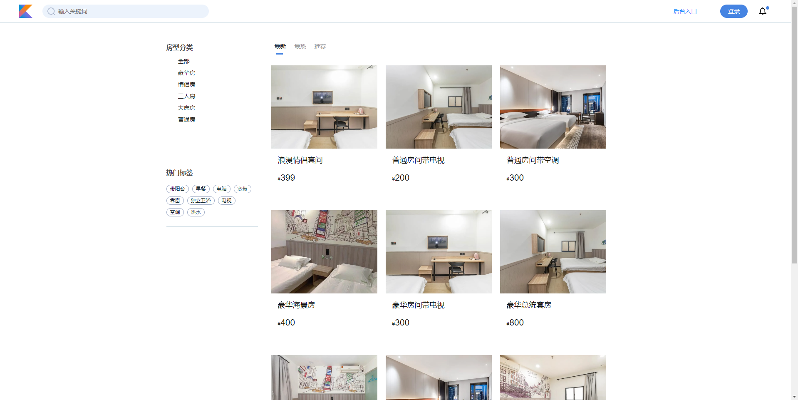

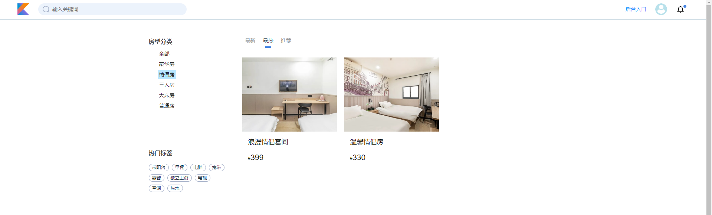

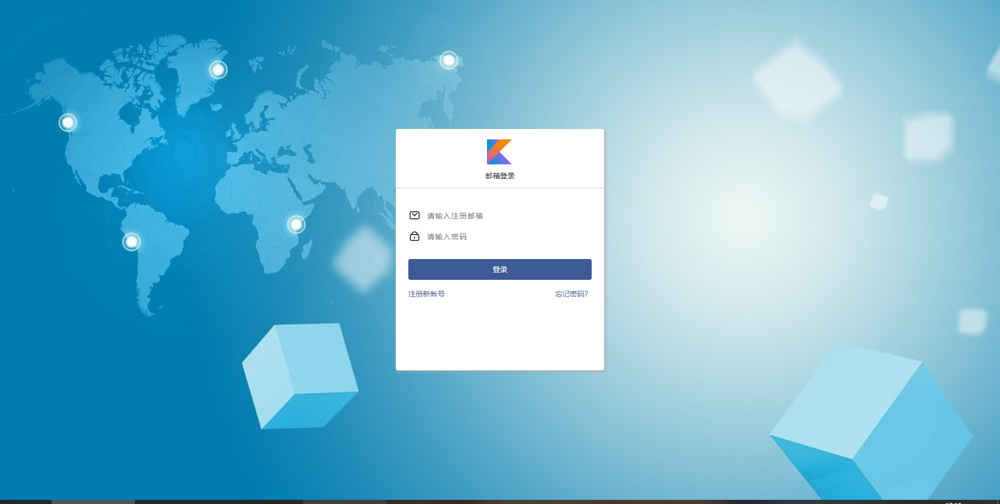

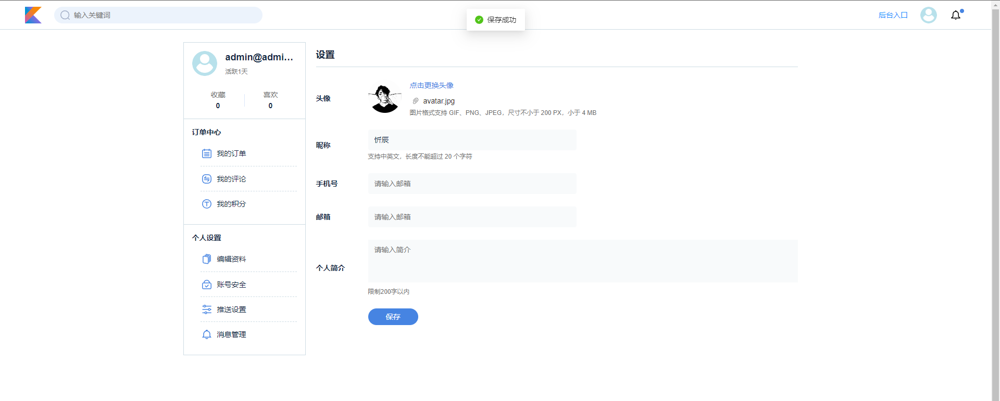

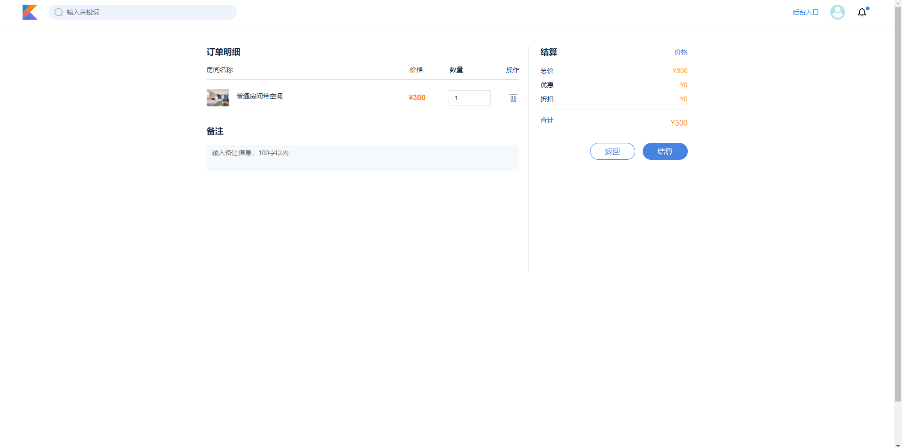

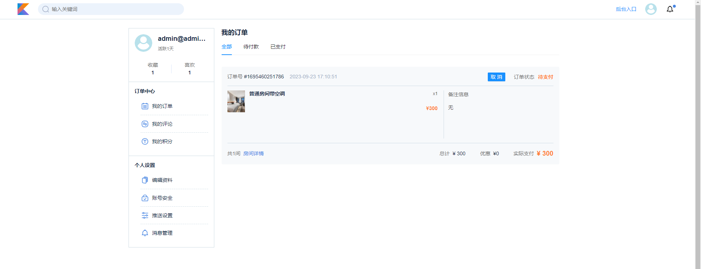

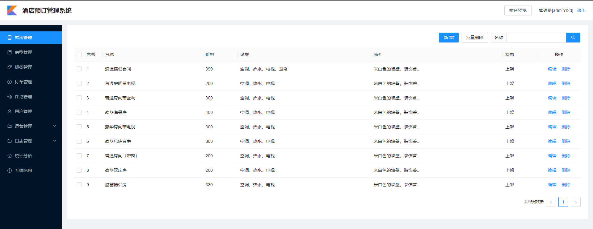

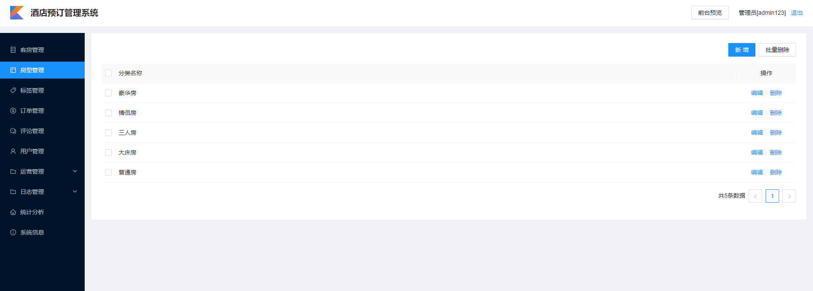

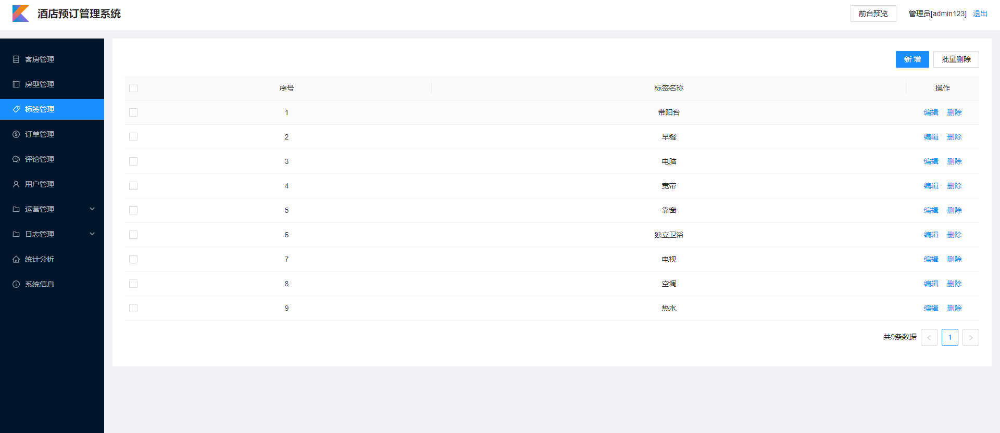

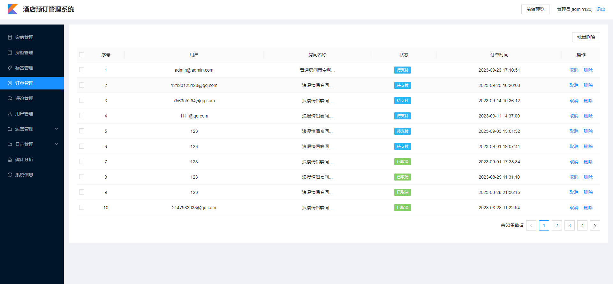

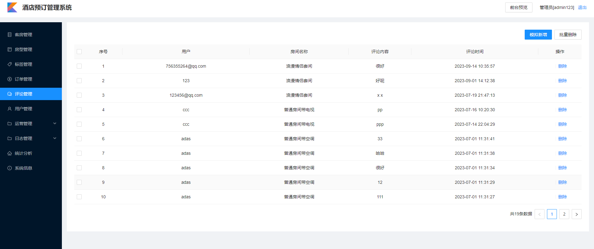

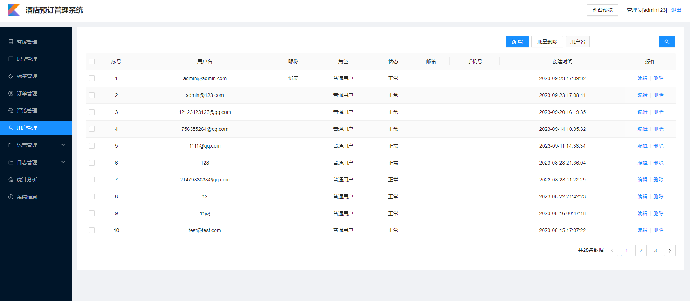

## 五、浏览地址

  - 前台地址  http://localhost:3000/index/portal  账号： 316595344@qq.com 密码： 123456
  - 后台地址(管理员登录) http://localhost:3000/adminLogin  账号： admin@163.com  密码：123456

## 六、安装教程

1. 使用Navicat或者其它工具，在mysql中创建对应名称的数据库，然后运行项目的`resource`目录下的sql脚本（询问作者索取）；

2. 使用IDEA/Eclipse导入项目，若为maven项目请选择maven;导入成功后请执行maven clean;maven install命令，然后运行；

3. 进入 `hotel\server\src\main\resources` 修改 `application.yml` 里面的数据库配置，`application.yml`中的 `BASE_LOCATION`改为本机项目所在目录， `spring.datasource.password` 改为本机mysql密码；

4. 启动项目后端项目

5. 使用黑窗口（cmd）进入 `~\hotel\web` 目录，执行 `npm install`，成功之后执行 `npm run dev` 启动前端项目

**完整代码收费 +   316595344     或    lz316595344  咨询**

**接毕业设计和论文**
